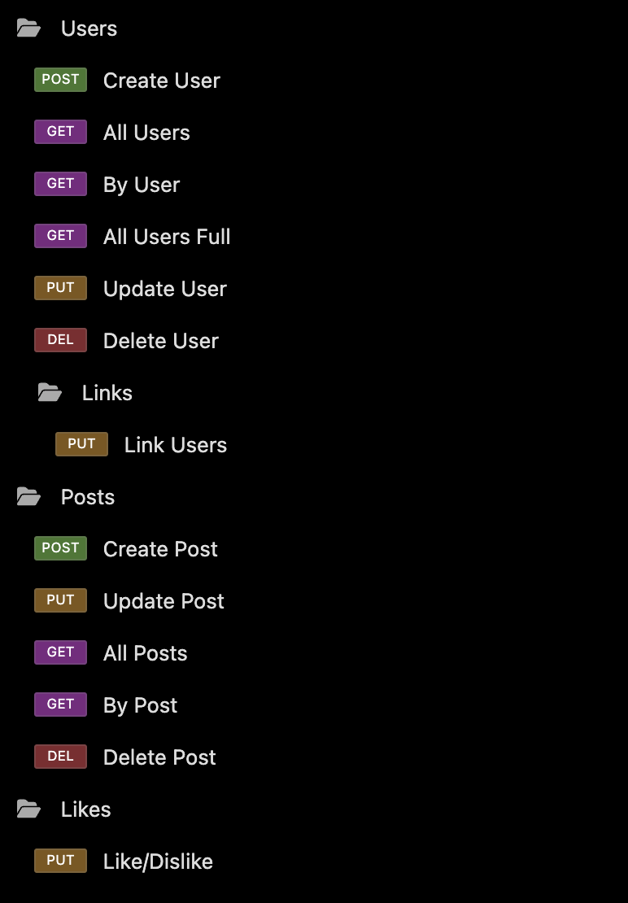

<p align="center">
  
</p>

<h1 align="center">Silicon API</h3>

<p align="center"><i>Let your ideas flow like bits through silicon.</i></p>

<p align="center">
  <a href="https://github.com/Rod-Freedom/C18-Silicon-API/blob/main/LICENSE"></a>
</p>

<br>
<br>

## **ABOUT THE PROJECT**
### **Overview**
Welcome to ***Silicon API***, your go-to destination for all things tech! At ***Silicon API***, we believe that technology is not just about circuits and code but about the flow of ideas that shape our digital future. This is a back-end API to manage users, posts and likes in the most efficient way!

Our name, reflects the fundamental element of the tech world—silicon chips are the bedrock of modern computing. Just as silicon enables the flow of information in electronics, we aim to enable the flow of ideas through our content, helping you to innovate and excel.

*Read the documentation [**here**](https://github.com/Rod-Freedom/C18-Silicon-API).* <br>
*Watch our tutorial [**here**](https://youtu.be/a4s0oAX4zgU).*

<br>
<br>

## Table of Contents
- [License](#license)
- [Resources](#resources)
- [Get Started](#get-started)
- [Usage](#usage)
- [Demos](#demos)
- [Contribute](#contribute)
- [Credits](#credits)

<br>

[(Back to the Top)](#about-the-project)

## Resources
* **Models**
    * For Mongoose
        * Models.
        * `new schema()`
        * `model()`
        * `Model.find()`
        * `Model.where()`
        * `Model.save()`
        * `Model.findOne()`
        * `Model.findOneAndDelete()`
        * `Model.findOneAndUpdate()`
        * Combine vanilla JS with Mongoose to alter data.
        * `schema.method`
        * `schema.virtual().get()`
* **Controllers**
    * For Express.js
        * RESTful API routes with `express.Router()`.
        * User routes with `express.Router()`.
        * `app.use()` for middleware.
        * `express.static()` for static routes.
        * `res.send()`.
        * `res.json()`.
        * `res.render()`.
        * `app.route().method()` routes.
        * `app.get()` routes.
        * `app.post()` routes.
        * `app.delete()` routes.
        * `app.put()` routes.
    * For JavaScript
        * ES6 modules.
        * Promises.
        * Extensive object and array destructuring.
        * Polymorphism for methods.
        * Classes and constructors.
        * Extended classes.
        * `static` methods.
        * `async` and `await` executions.
        * `try` & `catch` executions.
        * Structured error handling to prevent unexpected crashes.
    * For Node.js
        * NPM packages
            * Express.js
            * Mongoose

<br>

[(Back to the Top)](#about-the-project)

## Get Started
*Watch our tutorial [**here**](https://youtu.be/a4s0oAX4zgU).*

<br>

> **IMPORTANT |** ***Silicon API** isn't online yet, so you'll have to run it locally.*

<br>

Once you have the repo on your computer after running `git clone`, open your command line. Make sure to open the ***Silicon API*** repo folder in your terminal. Use `npm i` to install all the modules needed to run ***Silicon API***.

First clone:

```bash
$ git clone https://github.com/Rod-Freedom/C18-Silicon-API.git
```

<br>

Finally, install the modules, and you're ready to go:

```bash
$ npm i
```

<br>

[(Back to the Top)](#about-the-project)

## Usage
*Watch our tutorial [**here**](https://youtu.be/a4s0oAX4zgU).*

> **IMPORTANT |** ***Silicon API** isn't online yet, so you'll have to run it locally.*

<br>

***Silicon API*** is purely back-end. To run it locally, open the Silicon API folder in your terminal, then type `node server.js` or `npm start` and hit `enter`.

```bash
$ npm start
```

<br>

You have `GET`, `POST`, `PUT` and `DELETE` methods for each route.
The available routes for `/api`, are: 
* /users
    * /users/populated
    * /link
* /posts
* /likes\* *Only `PUT` method*

When doing a `PUT` or `DELETE`, you'll have to add the ID parameter route (/id) to target a specific user or post.
You may also do it with `GET`.

<br>

<p align="left">
  
</p>

<br>

[(Back to the Top)](#about-the-project)

## License
<br>
See the [license](https://github.com/Rod-Freedom/C18-Silicon-API/blob/main/LICENSE) for more details.

<br>

[(Back to the Top)](#about-the-project)

## Contribute
If you have suggestions or want to help with some improvements, you can write me by [email](mailto:rod@alpacaazul.mx).

<br>

[(Back to the Top)](#about-the-project)

## Credits
All the code was created from scratch by [Rod's Freedom](https://github.com/Rod-Freedom).

<br>

[(Back to the Top)](#about-the-project)