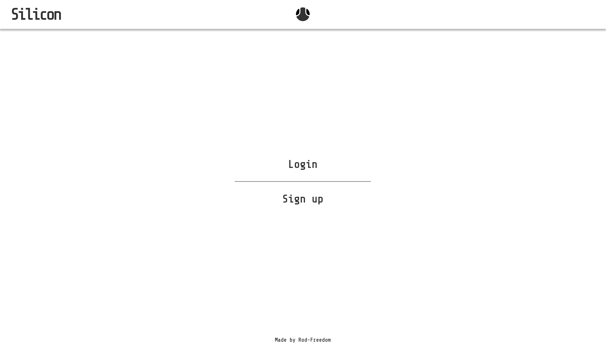
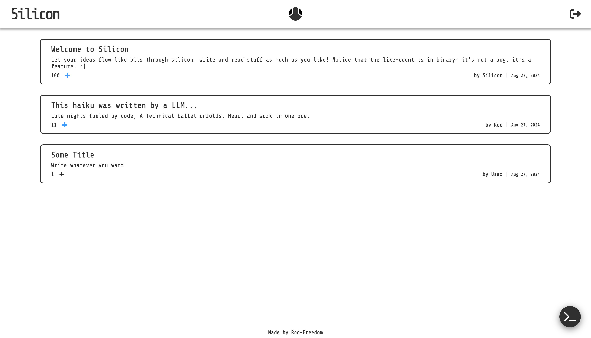
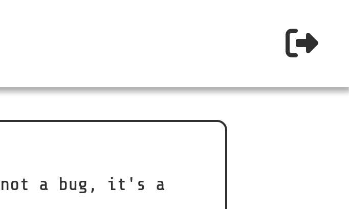

  

<h1 align="center">Silicon API</h3>

<i>Let your ideas flow like bits through silicon.</i>

  

 
 

## **ABOUT THE PROJECT**
### **Overview**
Welcome to ***Silicon***, your go-to destination for all things tech! At ***Silicon***, we believe that technology is not just about circuits and code but about the flow of ideas that shape our digital future.

Our name, reflects the fundamental element of the tech world—silicon chips are the bedrock of modern computing. Just as silicon enables the flow of information in electronics, we aim to enable the flow of ideas through our content, helping you to innovate and excel.

*Read the documentation [**here**](https://github.com/Rod-Freedom/C18-Silicon-API).*  
*Watch our tutorial [**here**](https://youtu.be/6y5HbyOrYkY).*

 
 

## Table of Contents
- [License](#license)
- [Resources](#resources)
- [Get Started](#get-started)
- [Usage](#usage)
- [Demos](#demos)
- [Contribute](#contribute)
- [Credits](#credits)

 

[(Back to the Top)](#about-the-project)

## Resources
* **Models**
    * For Sequelize
        * Models.
        * `Models.create()`
        * `Models.destroy()`
        * `Models.findAll()`
            * `include: []`
        * `Models.findByPk()`
            * `where: {}`
        * `Models.hasOne()`
        * `Models.hasMany()`
        * `Models.belongsTo()`
        * `onDelete`, `foreignKey`, `autoIncrement`, etc.
    * Hooks
* **Views**
    * For handlebars
        * Helpers.
            * Binary converter.
            * Date formatter.
            * Username formatter.
        * Layouts.
        * Partials.
        * Built-in Helpers
            * `#if` `else`
            * `#each as | |`
* **Controllers**
    * For Express.js
        * RESTful API routes with `express.Router()`.
        * User routes with `express.Router()`.
        * `app.use()` for middleware.
        * `express.static()` for static routes.
        * `res.send()`.
        * `res.json()`.
        * `res.render()`.
        * `app.get()` routes.
        * `app.post()` routes.
        * `app.delete()` routes.
        * `app.put()` routes.
    * For JavaScript
        * ES6 modules.
        * Promises.
        * Extensive object and array destructuring.
        * Polymorphism for methods.
        * Classes and constructors.
        * Extended classes.
        * `static` methods.
        * `async` and `await` executions.
        * `try` & `catch` executions.
        * Structured error handling to prevent unexpected crashes.
    * For Node.js
        * NPM packages
            * Dotenv
            * Sequelize
            * Express.js
            * PG
            * bycript
            * Express.js Session
            * Sequelize Session
            * Express Handlebars
        * `process.env` variables.
        * `res.session` variables.

 

[(Back to the Top)](#about-the-project)

## Get Started
*Watch our tutorial [**here**](https://youtu.be/6y5HbyOrYkY).*

No installation is required, just go to the site [here](https://silicon-a6vt.onrender.com) and explore Silicon!

 

[(Back to the Top)](#about-the-project)

## Usage
*Watch our tutorial [**here**](https://youtu.be/6y5HbyOrYkY).*

**Silicon** is easy and intuitive to use.

You'll be redirected to the login page once you've entered the site as a new user. Go to the site [here](https://silicon-a6vt.onrender.com).

Click `Sign up` if you don't have a user yet; else, click on Login.

> 

After logging in, you'll be redirected to the home/feed page. There, you can like, post, and read anything you want.

> 

Your session will expire after ten minutes. If you want to log out yourself, just click the logout button at the top right corner.

> 

 

[(Back to the Top)](#about-the-project)

## License
 
See the [license](https://github.com/Rod-Freedom/C18-Silicon-API/blob/main/LICENSE) for more details.

 

[(Back to the Top)](#about-the-project)

## Contribute
If you have suggestions or want to help with some improvements, you can write me by [email](mailto:rod@alpacaazul.mx).

 

[(Back to the Top)](#about-the-project)

## Credits
All the code was created from scratch by [Rod's Freedom](https://github.com/Rod-Freedom).

 

[(Back to the Top)](#about-the-project)